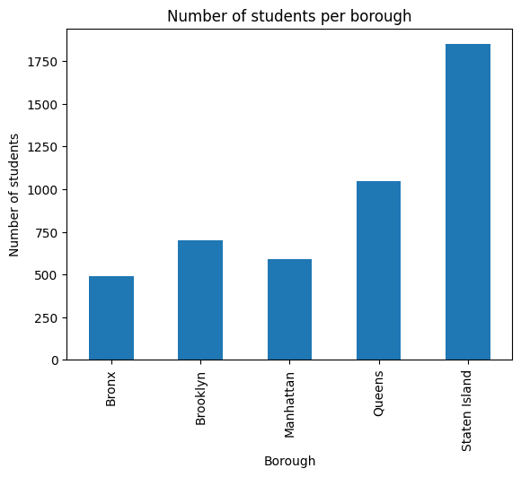

# 🏫 School Directory Exploration

## 🎯 Goal
Explore the NYC School Directory to understand how schools and student
populations are distributed across boroughs.

---

## 📊 Data Source
- NYC School Directory (public schools)
- Aggregated at the borough level
- Metrics based on reported school enrollment and grade span information

---

## 📈 Visualisations
Average number of schools and students per borough based on the NYC School Directory.

---

## 🔍 Key Insights

- There is a strong imbalance in school distribution across boroughs.
Brooklyn has the highest number of schools (121), followed closely by the Bronx (118), while Staten Island has by far the fewest schools (10). 

- All schools in Brooklyn offer Grade 9 as part of their grade range, including schools that begin at earlier grades.

- Average student enrollment per school shows an inverse pattern to school counts.
Boroughs with fewer schools tend to have larger schools on average. Staten Island (10 schools) and Queens (80 schools) have the highest average student populations per school, while the Bronx (118 schools) has the lowest.

- Grade span structures are highly consistent across boroughs.
Nearly all schools extend to Grade 12, with only minor variation in lower grade boundaries, indicating a standardized upper-grade offering citywide.

---

## 📌 Analytical Implications
These structural differences provide essential context for later analyses.
Comparisons of incidents or academic performance across boroughs must account for
differences in school density and average school size.  
Normalizing metrics by student population is therefore critical to avoid misleading conclusions.
